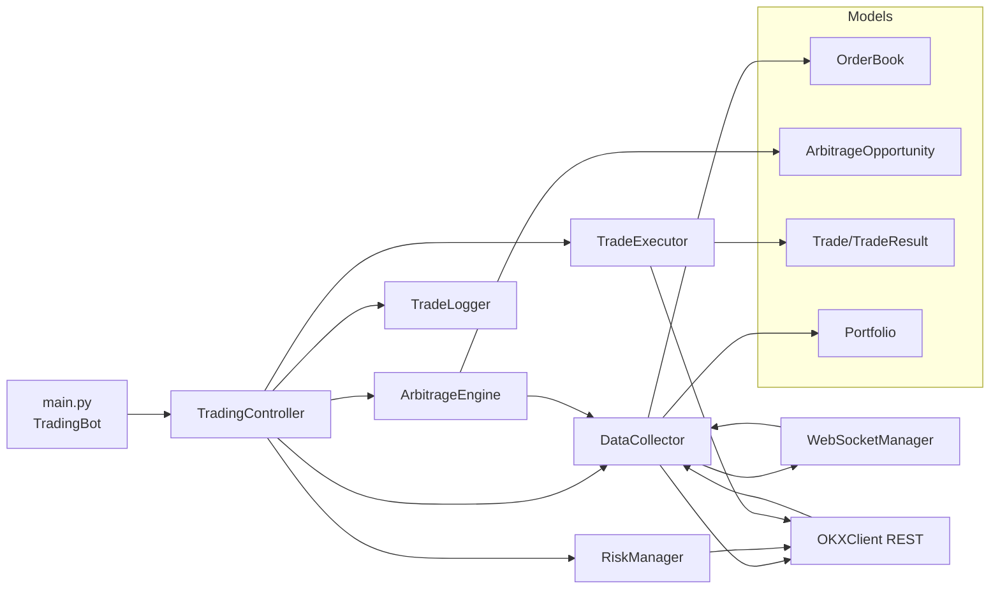

# Architecture Map

> 约束说明：不阅读 `okex/` 目录内部实现，仅定位项目内对 OKX 的封装与调用点。

## 项目结构概览（核心目录）

- **core/**：核心交易逻辑与运行编排
  - TradingController / DataCollector / WebSocketManager / ArbitrageEngine / RiskManager / TradeExecutor / OKXClient
- **models/**：核心数据模型
  - OrderBook / Portfolio / Trade / ArbitragePath & ArbitrageOpportunity
- **config/**：配置与密钥管理
  - config_manager.py / settings.ini / secrets.ini(.example)
- **utils/**：日志与性能辅助
  - logger.py / trade_logger.py / performance_analyzer.py
- **tests/**：测试脚本与模型测试

## 核心模块一览（职责 / 输入输出 / 关键方法 / 依赖）

> 仅列接口方法名（不贴实现代码）。

### TradingController
- **职责**：主控制器，统一编排行情采集 → 机会识别 → 风控 → 执行 → 统计/日志。
- **输入**：配置（ConfigManager）、行情/余额数据（DataCollector）、套利机会（ArbitrageEngine）。
- **输出**：交易执行结果、统计/状态、日志回调通知。
- **关键方法**：
  - `start()` / `stop()` / `_trading_loop()`
  - `_process_opportunity_in_loop()`
  - `get_status()` / `get_stats()` / `get_risk_stats()`
  - `enable_trading()` / `disable_trading()`
- **依赖**：DataCollector、ArbitrageEngine、TradeExecutor、RiskManager、TradeLogger。

### DataCollector
- **职责**：统一数据入口，整合 REST 与 WebSocket 行情/余额数据并缓存。
- **输入**：订阅交易对、WebSocket 推送数据、REST API 数据。
- **输出**：OrderBook、Portfolio、数据回调。
- **关键方法**：
  - `start()` / `stop()`
  - `get_orderbook()` / `get_arbitrage_orderbook()`
  - `get_balance()`
  - `add_data_callback()` / `set_balance_update_callback()`
- **依赖**：OKXClient、WebSocketManager、OrderBook、Portfolio。

### WebSocketManager
- **职责**：管理 OKX WebSocket 连接、订阅订单簿与账户频道、解析推送并回调。
- **输入**：API 凭据（ConfigManager）、WebSocket 消息。
- **输出**：订单簿缓存、余额更新回调。
- **关键方法**：
  - `connect()` / `disconnect()` / `subscribe_orderbooks()`
  - `get_orderbook()` / `get_best_prices()`
  - `set_balance_update_callback()`
- **依赖**：ConfigManager、websockets 客户端。

### ArbitrageEngine
- **职责**：使用订单簿进行套利路径计算与机会识别。
- **输入**：OrderBook（来自 DataCollector）、路径配置（ConfigManager）。
- **输出**：`List[Dict]` 机会列表、`ArbitrageOpportunity`。
- **关键方法**：
  - `find_opportunities()`
  - `calculate_arbitrage_from_steps()` / `calculate_path_profit()`
  - `validate_data_consistency()`
  - `start_monitoring()` / `stop_monitoring()`（线程监控模式）
- **依赖**：DataCollector、ConfigManager、ArbitragePath/ArbitrageOpportunity。

### RiskManager
- **职责**：仓位/频率/损失等风控校验与交易额度计算。
- **输入**：ArbitrageOpportunity、总资产（USDT 估算）、余额快照（由 TradingController 传入；OKXClient 为可选回退）。
- **输出**：RiskCheckResult、建议交易额度、风险统计。
- **关键方法**：
  - `validate_opportunity()`
  - `check_arbitrage_frequency()` / `check_position_limit()`
  - `calculate_position_size()`
  - `record_arbitrage_attempt()` / `get_risk_statistics()`
- **依赖**：ConfigManager、（可选）OKXClient、ArbitrageOpportunity。

### TradeExecutor
- **职责**：执行套利交易（下单/撤单/等待成交）并产出结果记录。
- **输入**：ArbitrageOpportunity、投资金额。
- **输出**：交易执行结果字典、TradeResult 列表、ArbitrageRecord。
- **关键方法**：
  - `execute_arbitrage()`
  - `_execute_single_trade()` / `_wait_order_filled()`
  - `_generate_trades()` / `get_balance_check()`
- **依赖**：OKXClient、ArbitrageOpportunity、Trade/TradeResult。
- **注意**：`execute_arbitrage()` 调用的 `_execute_single_trade_with_safety()` / `_handle_trade_failure()` / `_post_trade_processing()` 已在 `TradeExecutor` 内定义。

## 架构关系图（Mermaid）

> READ_ONLY/无凭据模式：`OKXClient` 与 `WebSocketManager` 会进入 `public_only` 并禁用私有账户/交易能力，`TradingController` 设置 `read_only_mode` 并调用 `disable_trading()`。

## 与预期架构图一致/不一致差异清单（含证据与影响）

> 核验方式：阅读 `main.py` 与 `core/*` 主链路代码，结合 `rg` 搜索直接调用点。未发现生产链路绕过 TradingController 的下单路径；若后续新增调用请复核。

### ✅ 一致点
1) **主链路编排由 TradingController 统一负责**：`main.py` 只创建 `TradingController` 并启动系统，核心流程在 `TradingController._trading_loop()` 完成。

### ⚠️ 不一致/差异点
1) **套利引擎存在“线程监控模式”但主链路未使用**
   - **证据**：`ArbitrageEngine.start_monitoring()` / `monitor_opportunities()` 线程模式存在，但 `TradingController.start()` 采用同步 `find_opportunities()` 方式，明确“不再使用回调模式”。
   - **影响**：
     - 设计上存在两条入口路径（同步循环 vs 线程回调），若被外部启用线程模式，可能绕开 `TradingController` 的统一节奏与风险/日志边界。
     - 可导致并发/节奏不一致、日志链路分裂。
   - **建议**：文档中标注“仅主链路使用同步模式”，避免生产中直接启用监控线程。

2) **缺少 secrets.ini 时系统进入只读模式（READ_ONLY）**
   - **证据**：
     - `OKXClient` 在无凭据时 `public_only=True`，账户/交易接口禁用。
     - `WebSocketManager` 在无凭据时仅连接公共频道，跳过私有频道。
     - `TradingController` 无凭据时 `read_only_mode=True` 并调用 `disable_trading()`。
   - **影响**：系统可启动并监控行情，但私有账户/交易能力不可用。
   - **建议**：文档标注 READ_ONLY 行为与受限能力，避免误以为启动失败。

3) **主链路余额口径已统一为 DataCollector 余额快照**
   - **证据**：`TradingController` 获取 `DataCollector.get_balance()` 的 `Portfolio.balances` 作为 `balance_snapshot`，并用 `RiskManager.calculate_total_balance_usdt()` 计算总资产；`RiskManager.validate_opportunity()`/`calculate_position_size()`/`check_position_limit()` 主链路均使用传入的快照并在余额不可用时拒绝交易。
   - **影响**：主链路风控与交易量计算使用同一份余额快照；余额不可用时 fail-safe 拒绝交易。
   - **备注**：`RiskManager.get_current_balance()` 仍保留 OKXClient 余额回退（非主链路），用于无快照时的辅助查询。

4) **旁路/绕行风险（生产链路未发现，测试/潜在入口需标注）**
   - **验证结果**：`main.py` → `TradingController` 为唯一生产入口；未发现生产代码中直接绕过 `TradingController` 调用 `RiskManager`/`TradeExecutor` 的路径。
   - **潜在旁路**：
     - 测试代码直接实例化 `DataCollector` / `ArbitrageEngine` / `RiskManager` / `TradeExecutor`（测试路径，非生产）。
     - `ArbitrageEngine.start_monitoring()` 若外部直接启用，可能绕开 TradingController。
   - **风险**：绕过统一节奏与风控/日志边界，导致状态不一致或日志缺失。
   - **建议**：明确标注测试/非生产旁路，仅在受控环境使用。
