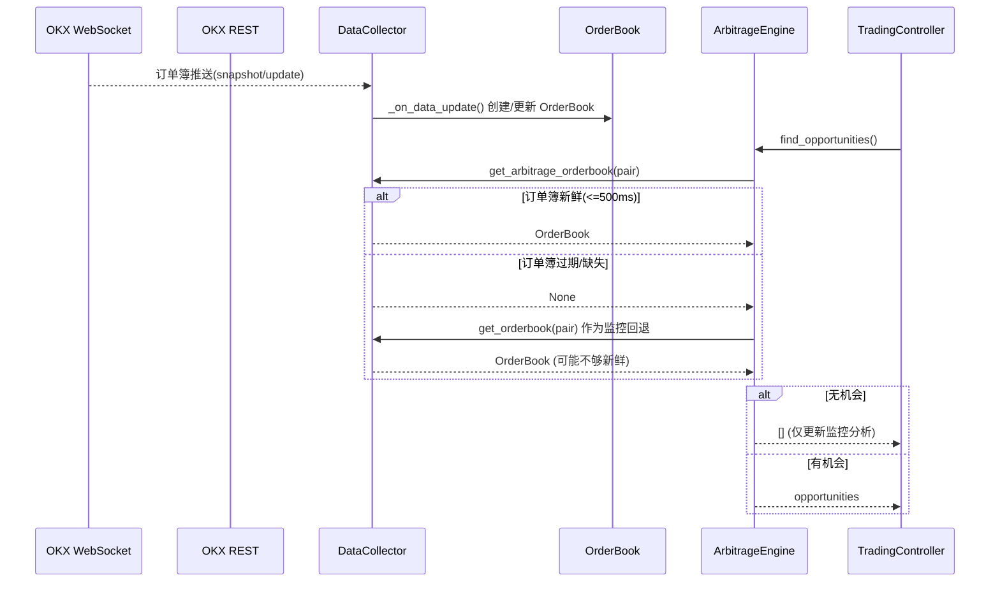
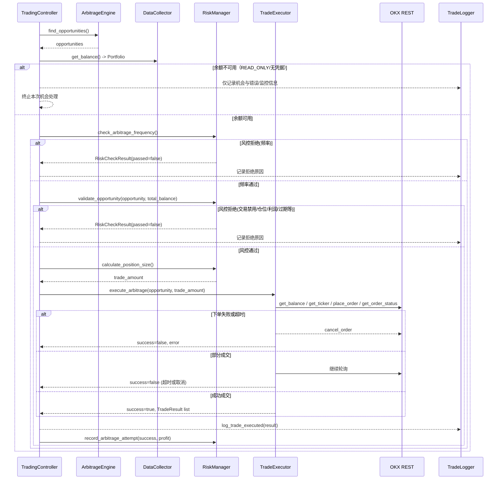
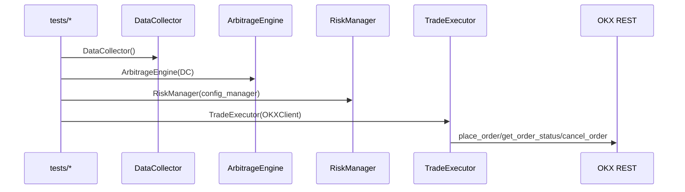

# Data & Trading Flows

## 关键状态/数据对象表（产生 → 消费 → 更新点）

| 对象 | 产生/更新点 | 主要消费者 | 备注 |
| --- | --- | --- | --- |
| **OrderBook** | DataCollector `_on_data_update()`（WS）或 `get_orderbook()`（REST fallback） | ArbitrageEngine `find_opportunities()`/`calculate_*` | 订单簿用于套利计算与监控显示；`get_arbitrage_orderbook()` 要求 500ms 新鲜度。 |
| **Opportunity**（Dict） | ArbitrageEngine `find_opportunities()` | TradingController `_trading_loop()` | 机会列表在主循环处理，并记录到 TradeLogger。 |
| **ArbitrageOpportunity** | TradingController `_process_opportunity_in_loop()` | RiskManager / TradeExecutor | 由 `ArbitragePath` 组装，用于风控与执行。 |
| **Trade / TradeResult** | TradeExecutor `_generate_trades()` / `_execute_single_trade()` / `_wait_order_filled()` | TradingController `_log_trade_result()` / `_handle_trade_result()` | 交易结果驱动统计、日志与风控记录。 |
| **Portfolio** | DataCollector `get_balance()`（REST） | TradingController `_process_opportunity_in_loop()` | 余额用于估算总资产与计算交易量；READ_ONLY/无凭据时可能为 None，余额不保证可用或更新。 |

## 行情数据流时序（WS/REST → DataCollector → OrderBook → ArbitrageEngine → TradingController）

## 交易执行流时序（TradingController → ArbitrageEngine → RiskManager → TradeExecutor）

## 旁路/绕行的实际时序（测试/潜在入口）

> 生产主链路未发现绕过 TradingController 的下单路径。以下为测试/潜在旁路（需受控使用）。

